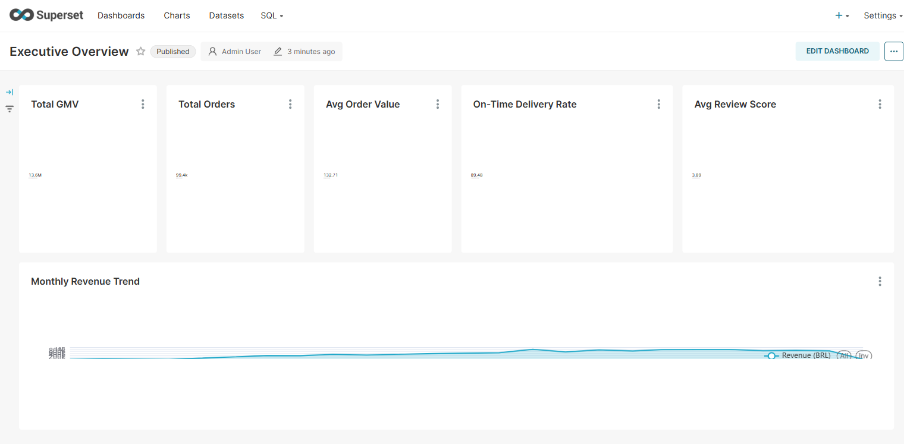
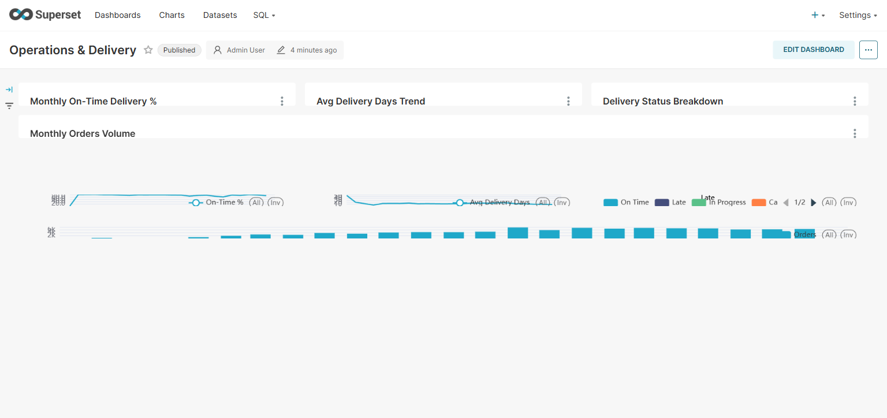
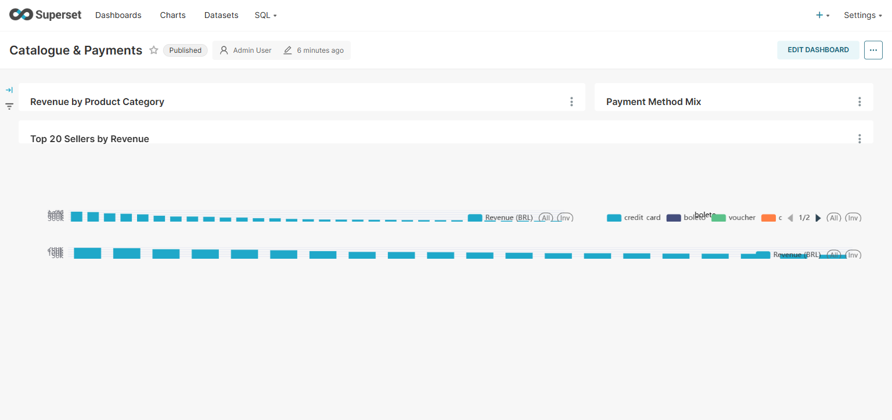
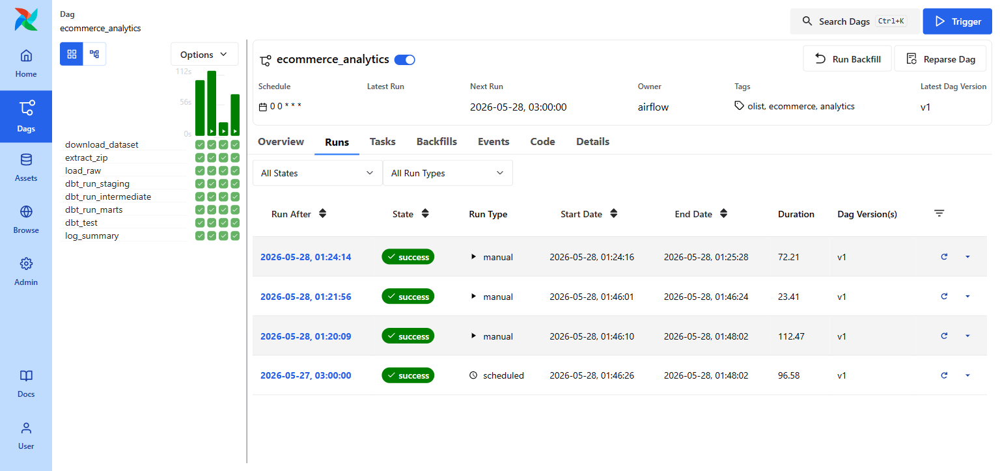

# 🛒 Ecommerce Analytics: End-to-End Order Intelligence Pipeline

**Ecommerce Analytics** is a production-grade order intelligence pipeline that ingests 99,441 real orders from the Olist Brazilian E-Commerce public dataset via the Kaggle REST API, loads 8 raw tables (112,650 order items, 103,886 payments, 99,224 reviews, 3,095 sellers, 32,951 products, 71 product categories) into a DuckDB columnar warehouse, transforms the data through 15 dbt models across three layers (8 staging views, 2 intermediate views, 5 mart tables), computes delivery KPIs — actual vs estimated delivery days, on-time rate (89.5%), days-late distribution — joins order financials with enriched order metadata using a two-step aggregation to avoid item-count weighting on review scores and delivery rates, materialises BRL 13,591,643 in gross merchandise value across 24 months (Sep 2016 – Sep 2018) into monthly revenue trends and seller/category performance marts, and surfaces all of this across 3 Apache Superset 4.1.1 dashboards totalling 13 charts — the complete analytical stack an e-commerce operations team would use to monitor GMV trends, delivery health, and category/seller performance.

| Metric | Value |
|--------|-------|
| Orders | 99,441 (Olist Brazilian E-Commerce, Kaggle) |
| Order items | 112,650 |
| Payment records | 103,886 |
| Customer reviews | 99,224 |
| Sellers | 3,095 |
| Products | 32,951 across 71 categories |
| Gross Merchandise Value | BRL 13,591,643 (Sep 2016 – Sep 2018) |
| On-time delivery rate | 89.5% of delivered orders |
| Avg order value | BRL 132.71 |
| Avg review score | 3.89 / 5.0 |
| Airflow tasks | 8 (ingest → extract → load → 4 dbt layers → test → summary) |
| dbt models | 15 (8 staging · 2 intermediate · 5 marts) |
| dbt tests | 54 (all passing) |
| Pytest tests | 22 (all passing) |
| Dashboards | 3 (13 charts across Executive Overview, Operations, Catalogue & Payments) |
| Cost to run | $0 — open data + local stack only |

---

## 🎯 Project Goal

E-commerce operations teams need to answer three questions every week: is GMV growing or declining, are orders being delivered on time, and which categories and sellers are driving value? The raw data to answer these questions arrives as a web of joined tables — orders, order items, payments, reviews, customers, sellers, products — where delivery KPIs require date arithmetic, seller performance requires multi-level aggregation to avoid being skewed by high-item-count orders, and monthly revenue requires careful NULL handling for orders that have no matching item records. The Olist dataset, with its 7-table relational structure and known data quality issues (misspelled column names, 789 duplicate review IDs, isolated zero-revenue orders), is a realistic proxy for the messy multi-source data a real e-commerce data team would encounter.

Ecommerce Analytics builds the full pipeline on the real Olist dataset. The staging layer handles the source data's quirks (spelling corrections, type casting, accepted-values validation). The intermediate layer joins the order, customer, seller, and review tables to compute delivery KPIs using DATEDIFF-based actual vs estimated delivery arithmetic, then separately aggregates financial data at the order level to keep revenue joins clean. The five mart tables materialise the exact grains needed for each dashboard view — monthly revenue with GMV trends, order-level delivery status for operations monitoring, category and seller performance for commercial analysis, and payment method mix. The three Superset dashboards surface these marts as 13 charts accessible to a non-technical audience, requiring only a browser and Docker to reproduce.

---

## 🧬 System Architecture

1. **Ingestion — Kaggle REST API v1** — `loader.py` downloads the Olist Brazilian E-Commerce dataset zip from `https://www.kaggle.com/api/v1/datasets/download/olistbr/brazilian-ecommerce` using HTTP Basic Auth (`requests.get(..., auth=(KAGGLE_USERNAME, KAGGLE_KEY), stream=True)`); the Kaggle CLI's KGAT token mechanism is incompatible with the REST endpoint — CLI auth fails with 401 even with valid credentials — so the REST API with username/key is used directly; the zip is streamed in 8KB chunks to `/opt/airflow/data/raw/` to avoid loading the full ~40MB into memory

2. **Raw loading — DuckDB** — `load_raw()` in `loader.py` extracts 8 CSV files from the zip, iterates the `TABLE_MAP` dict, and loads each via `CREATE TABLE AS SELECT * FROM read_csv_auto(...)` with `DROP TABLE IF EXISTS` for idempotency; 8 raw tables land in `raw.*` schema: `raw_orders`, `raw_order_items`, `raw_order_payments`, `raw_order_reviews`, `raw_customers`, `raw_sellers`, `raw_products`, `raw_product_category_translation`

3. **dbt staging layer** — 8 views clean source tables: timestamp strings are cast to TIMESTAMP, numeric columns are cast to DOUBLE/INTEGER, and `stg_products.sql` corrects the Olist dataset's two persistent misspellings (`product_name_lenght` → `product_name_length`, `product_description_lenght` → `product_description_length`) which would otherwise surface as confusing column names in all downstream models; Portuguese category names are joined to their English translations; 54 dbt tests validate uniqueness, not-null, and accepted-values on all status enums and timestamp columns

4. **dbt intermediate layer** — `int_orders_enriched` joins orders, customers, sellers, and reviews, computing delivery KPIs using `DATEDIFF('day', order_purchase_at, delivered_customer_at) AS actual_delivery_days`, `delivered_customer_at <= estimated_delivery_at AS is_on_time`, and `DATEDIFF('day', estimated_delivery_at, delivered_customer_at) AS days_late` (positive = late); `int_order_financials` aggregates order items to order-level revenue via `SUM(price) AS order_revenue` — kept as a separate model so the mart LEFT JOINs this clean aggregation rather than joining raw items directly, which would require additional deduplication of the enriched order rows

5. **dbt mart layer** — 5 materialised tables built as `config(materialized='table')`: `mart_monthly_revenue` groups by `DATE_TRUNC('month', ...)` with `HAVING total_revenue > 0` to exclude one October 2018 data artifact (4 orders with no matching items in the Olist dataset); `mart_order_performance` classifies each order into a `delivery_status` string (On Time / Late / Cancelled / In Progress / Unknown); `mart_seller_performance` uses a two-step aggregation (order-level first, then seller-level) to compute review scores and on-time rates that reflect actual orders rather than order items; `mart_product_performance` joins through category translations; `mart_payment_analysis` groups by payment type and installments

6. **Apache Superset 4.1.1** — connected to DuckDB via `duckdb-engine==0.13.2` using `duckdb:////opt/airflow/data/ecommerce.duckdb` with `engine_params: {"connect_args": {"read_only": true}}`; Superset metadata stored in a dedicated `superset` PostgreSQL database (not the `airflow_meta` database); 3 published dashboards totalling 13 charts across 5 datasets

All 8 stages run as an **Apache Airflow 3.0 DAG** (`ecommerce_analytics`) with `duckdb_pool` (1 slot) serialising all DuckDB writes, Airflow 3.0 AIP-72 Task SDK imports (`from airflow.sdk import dag, task`), and lazy imports inside callables to keep DAG parse time under 300s.

---

## 🛠️ Technical Stack

| **Layer** | **Tool** | **Version** |
|---|---|---|
| Orchestration | Apache Airflow (LocalExecutor, AIP-72) | 3.0 |
| OLAP database | DuckDB | 1.1.3 |
| Data transformation | dbt-duckdb | 1.8.4 |
| Data source | Kaggle REST API v1 | — |
| Dashboard | Apache Superset | 4.1.1 |
| DuckDB SQLAlchemy driver | duckdb-engine | 0.13.2 |
| Metadata database | PostgreSQL | 15 |
| Containerisation | Docker Compose (7 services) | — |
| Language | Python | 3.12 |

---

## 📊 Performance & Results

- **99,441 orders** downloaded from Kaggle (~40MB zip) in ~9s; extracted and loaded across 8 raw tables in ~3s; full ingestion + load completes under 15 seconds
- **Full 8-task pipeline** completes in approximately **72 seconds** end-to-end under the `duckdb_pool` sequential execution model
- **dbt test suite** (54 tests across 3 layers) passes in ~14s; 0 warnings, 0 errors
- **Pytest suite** (22 tests) covering raw ingestion validation and mart transformation correctness passes in ~0.3s against the live DuckDB warehouse
- **On-time delivery rate** of 89.5% across 24 months: 88,644 on-time orders, 7,826 late, 1,729 in-progress, 1,234 cancelled
- **Payment mix**: credit card dominates at 76,655 orders (BRL 12.5M, 92% of GMV); boleto 19,784 orders; voucher 3,866; debit card 1,528
- **Top category by GMV**: health_beauty (8,836 orders, BRL 1,258,681); top by order count: bed_bath_table (9,417 orders)
- **Seller performance**: 3,095 unique sellers tracked with per-seller order count, GMV, avg review score, and on-time delivery rate

---

## 📸 Dashboard

### Executive Overview



*Five KPI tiles — Total GMV (BRL 13.6M), Total Orders (99.4k), Avg Order Value (132.71), On-Time Delivery Rate (89.48%), Avg Review Score (3.89) — backed by the monthly revenue trend area chart (Sep 2016 – Sep 2018).*

### Operations & Delivery



*Monthly on-time delivery % trend, avg delivery days trend, delivery status donut (On Time / Late / In Progress / Cancelled), and monthly order volume bar chart showing the platform's growth from ~100 orders/month in late 2016 to ~7,000 in late 2018.*

### Catalogue & Payments



*Revenue by product category bar chart (top categories: health_beauty, watches_gifts, bed_bath_table), payment method mix pie, and top-20 sellers by revenue bar chart.*

### Airflow DAG — 8/8 Success



*Runs page showing the most recent manual trigger completing successfully in 72.21 seconds. Task grid (left panel) shows 8 tasks: download_dataset → extract_zip → load_raw → dbt_run_staging → dbt_run_intermediate → dbt_run_marts → dbt_test → log_summary — all green in the final column.*

---

## 📑 Data Sources

| Source | Method | Records | Key Fields |
|--------|--------|---------|-----------|
| [Olist Brazilian E-Commerce (Kaggle)](https://www.kaggle.com/datasets/olistbr/brazilian-ecommerce) | Kaggle REST API v1 HTTP Basic Auth | 99,441 orders | Order status, purchase/approval/delivery timestamps, customer/seller/product IDs |
| Olist Order Items | Same zip download | 112,650 items | Order ID, product ID, seller ID, price, freight value |
| Olist Order Payments | Same zip download | 103,886 records | Payment type, installments, payment value |
| Olist Order Reviews | Same zip download | 99,224 reviews | Review score (1–5), comment text, review creation/answer timestamps |
| Olist Customers | Same zip download | 99,441 records | Customer unique ID, city, state (zip code removed) |
| Olist Sellers | Same zip download | 3,095 records | Seller city, state |
| Olist Products | Same zip download | 32,951 products | Category name (Portuguese), dimensions, weight |
| Olist Product Category Translation | Same zip download | 71 categories | Portuguese → English category name mapping |

---

## 🧠 Key Design Decisions

- **Kaggle REST API v1 over Kaggle CLI** — the Kaggle CLI's modern authentication uses KGAT tokens stored in `~/.config/kaggle/kaggle.json`, but the REST endpoint `https://www.kaggle.com/api/v1/datasets/download/...` requires HTTP Basic Auth (username + API key), not Bearer token auth. Using the CLI inside Docker would require mounting credentials and managing the `~/.config` path; using `requests.get(url, auth=(KAGGLE_USERNAME, KAGGLE_KEY), stream=True)` is simpler, entirely environment-variable-driven, and avoids the CLI entirely. The `stream=True` parameter is essential — without it, `requests` buffers the full ~40MB zip in memory before the response body is available.

- **DuckDB `duckdb_pool` (1 slot) for write serialisation** — DuckDB supports only one writer per file at a time. Airflow's LocalExecutor runs multiple tasks simultaneously by default; without the pool, the `load_raw` task and any concurrent dbt task opening the same warehouse file would race and the loser would raise `IOException: Could not set lock on file`. The Airflow pool serialises all write tasks at the scheduling layer — no mutexes, no retry logic, no file-level locking code required. Superset uses `read_only=True` engine connections which can run concurrently with each other but are blocked while any writer holds the lock.

- **Two-step aggregation in `mart_seller_performance`** — a naive join of `int_orders_enriched` to order items and then a GROUP BY seller_id would weight the avg review score and on-time rate by the number of items in each order rather than by order count. An order with 5 items would contribute 5 times more to the seller's avg review score than an order with 1 item, even though the customer rated the seller once. The fix: first aggregate to order level (one row per order_id with its review score and is_on_time), then aggregate from that grain to seller level. The two-CTEs structure in `mart_seller_performance.sql` makes this explicit — `order_level AS (SELECT seller_id, order_id, ...)` then `GROUP BY seller_id` in the outer query.

- **COALESCE + HAVING for null-revenue orders** — the LEFT JOIN in `mart_monthly_revenue` between `int_orders_enriched` and `int_order_financials` produces NULL `order_revenue` for any order with no matching items (a known Olist dataset artifact). `ROUND(COALESCE(SUM(f.order_revenue), 0), 2)` converts month-level NULL sums to 0, which fixes the `not_null` dbt test. But October 2018 has exactly 4 such orders and `total_revenue = 0` — a data artifact at the dataset's trailing edge, not a real month with zero commerce. `HAVING ROUND(COALESCE(SUM(f.order_revenue), 0), 2) > 0` removes this artifact from the mart, keeping the 24-month time series clean without hardcoding a date filter.

- **`generate_schema_name` macro for dbt-duckdb schema resolution** — dbt-duckdb's default schema resolution prepends the target database name to custom schemas: `schema: marts` resolves to `main_marts` in DuckDB's catalog but dbt generates cross-references as `main.main_marts.table_name`. Superset dataset queries targeting `marts.*` fail because dbt never created that path. The macro overrides the default to use `custom_schema_name` as-is, ensuring schemas resolve identically in dbt's generated DDL and in Superset's dataset queries. Without this macro, every Superset dataset would need a `main.` prefix that breaks if the DuckDB path or catalog name changes.

- **Olist misspelled column correction in staging** — the Olist source CSV has two persistent misspellings in the products file: `product_name_lenght` and `product_description_lenght` (missing 'n'). Correcting these in `stg_products.sql` with explicit `CAST(product_name_lenght AS INTEGER) AS product_name_length` means all downstream models reference the correct spelling. Without this fix, the column names propagate through intermediate and mart models, appearing in Superset's column list where they would confuse analysts — but silently, since DuckDB accepts any identifier.

- **Olist duplicate `review_id` handling** — the `raw_order_reviews` table contains 789 non-unique `review_id` values, a known data quality issue in the public Olist dataset where the same review appears linked to multiple orders. Rather than deduplicating at staging (which would silently drop 789 rows and alter the review score distribution), the staging schema omits the `unique` test from `review_id` while retaining `not_null`. A comment in `schema.yml` documents the known count: "789 rows with duplicate review_id — known Olist dataset quality issue." Downstream models aggregate at order level, where the join to `raw_orders` naturally enforces one review per order.

- **Superset `read_only` DuckDB connection with `engine_params`** — Superset's DuckDB connection in the Advanced → Other → Engine Parameters field receives `{"connect_args": {"read_only": true}}`, which passes `read_only=True` to `duckdb.connect()` via SQLAlchemy. This allows Superset to run concurrent chart queries without competing for the write lock held by Airflow tasks, and prevents any accidental DDL from the Superset SQL Lab from modifying the warehouse.

- **Airflow 3.0 `api-server --workers 1`** — Airflow 3.0's default `api-server` launches multiple worker processes, each generating its own JWT signing key. A request authenticated by worker A's key is rejected by worker B as invalid, causing random 401 errors in the Airflow UI and broken task communication. Fixing this requires either a stable `AIRFLOW__API_AUTH__JWT_SECRET` environment variable (set in docker-compose.yml) or `--workers 1` to eliminate cross-worker key mismatch. Both are applied: the JWT secret is set as a Docker Compose env var, and `--workers 1` is explicit as a belt-and-suspenders safeguard.

---

## 📂 Project Structure

```text
ecommerce-analytics/
├── dags/
│   └── ecommerce_dag.py              # Airflow DAG — 8 tasks, duckdb_pool, Airflow 3.0 AIP-72 SDK
├── ingestion/
│   └── loader.py                     # Kaggle REST API v1 download, zip extract, DuckDB raw load
├── dbt/
│   ├── models/
│   │   ├── staging/
│   │   │   ├── stg_orders.sql               # Timestamp casts, status accepted-values
│   │   │   ├── stg_order_items.sql          # Price/freight DOUBLE cast
│   │   │   ├── stg_order_payments.sql       # Payment type normalisation
│   │   │   ├── stg_order_reviews.sql        # Score cast, NULL comment handling
│   │   │   ├── stg_customers.sql            # customer_unique_id retained for dedup analysis
│   │   │   ├── stg_sellers.sql              # Seller state normalisation
│   │   │   ├── stg_products.sql             # Misspelling fix: lenght → length (×2)
│   │   │   ├── stg_product_categories.sql   # Portuguese → English category join
│   │   │   └── schema.yml                   # 54 dbt tests (not_null, unique, accepted_values)
│   │   ├── intermediate/
│   │   │   ├── int_orders_enriched.sql      # DATEDIFF delivery KPIs, review join, seller join
│   │   │   ├── int_order_financials.sql     # SUM(price) per order — clean order-level revenue
│   │   │   └── schema.yml
│   │   └── marts/
│   │       ├── mart_monthly_revenue.sql     # Monthly GMV, orders, AOV, delivery KPIs, HAVING > 0
│   │       ├── mart_order_performance.sql   # Per-order delivery_status classification
│   │       ├── mart_seller_performance.sql  # Two-step aggregation for unbiased review/on-time rates
│   │       ├── mart_product_performance.sql # Category revenue, orders, avg review
│   │       ├── mart_payment_analysis.sql    # Payment type × installments pivot
│   │       └── schema.yml
│   ├── macros/
│   │   └── generate_schema_name.sql         # Prevents main.main_staging/main.main_marts prefix
│   ├── dbt_project.yml
│   └── profiles.yml                         # DuckDB path from DUCKDB_PATH env var, threads: 1
├── tests/
│   ├── __init__.py
│   ├── test_ingestion.py                    # 11 tests: raw table existence, row counts, nulls, prices
│   └── test_transformation.py               # 11 tests: mart row counts, delivery status, revenue >0
├── superset/
│   ├── superset_config.py                   # PostgreSQL metadata URI, SECRET_KEY, CSRF disabled
│   └── docker-entrypoint.sh                 # db upgrade → create-admin → init → run
├── assets/                                  # Dashboard + DAG screenshots (4 images)
├── Dockerfile                               # Airflow 3.0 image — gcc/g++ for DuckDB, pip as USER airflow
├── Dockerfile.superset                      # Superset 4.1.1 + duckdb==1.1.3 + duckdb-engine + psycopg2
├── docker-compose.yml                       # 7 services: postgres, init, api-server, scheduler,
│                                            #   dag-processor, triggerer, superset
├── init-db.sh                               # Creates superset DB alongside airflow_meta in postgres
├── requirements.txt                         # duckdb, dbt-core, dbt-duckdb, pandas, requests, pyarrow
├── passwords.json                           # SimpleAuthManager password file (admin/admin)
├── .env.example                             # KAGGLE_USERNAME, KAGGLE_KEY, AIRFLOW_JWT_SECRET
└── .gitignore                               # .env, *.duckdb, dbt/target/, dbt/dbt_packages/
```

---

## ⚙️ Installation & Setup

### Prerequisites

- Docker Desktop (2 GB RAM minimum)
- Kaggle account with API key (free — [kaggle.com/settings/account](https://www.kaggle.com/settings/account))
- Git

### Steps

1. **Clone the repository**
   ```bash
   git clone https://github.com/declerke/Ecommerce-Analytics.git
   cd Ecommerce-Analytics
   ```

2. **Configure environment**
   ```bash
   cp .env.example .env
   # Add your Kaggle credentials to .env:
   # KAGGLE_USERNAME=your_username
   # KAGGLE_KEY=your_api_key
   # Generate a JWT secret for Airflow:
   python -c "import secrets; print(secrets.token_hex(32))"
   # Paste the output as AIRFLOW_JWT_SECRET in .env
   ```

3. **Build and start all services**
   ```bash
   docker compose up -d
   ```
   First build installs dbt-duckdb, duckdb-engine, and psycopg2 inside the images (~3–4 minutes).

4. **Wait for initialisation** (~2–3 minutes)
   ```bash
   docker compose logs -f airflow-scheduler
   # Wait until: "Scheduler started"
   ```

5. **Trigger the pipeline**
   ```bash
   docker compose exec airflow-api-server airflow dags trigger ecommerce_analytics
   ```
   Or use the Airflow UI at `http://localhost:8080` (admin / admin). Pipeline completes in ~72 seconds.

6. **Access the stack**

   | Service | URL | Credentials |
   |---------|-----|-------------|
   | Airflow UI | http://localhost:8080 | admin / admin |
   | Superset | http://localhost:8088 | admin / admin |

---

## 🗄️ dbt Models

| Model | Layer | Type | Description |
|-------|-------|------|-------------|
| `stg_orders` | Staging | View | Casts 5 timestamp strings to TIMESTAMP; validates `order_status` accepted values (8 states: created/approved/invoiced/processing/shipped/delivered/unavailable/canceled) |
| `stg_order_items` | Staging | View | Casts price and freight_value to DOUBLE; retains order_id + product_id + seller_id join keys |
| `stg_order_payments` | Staging | View | Validates payment_type accepted values (credit_card/boleto/voucher/debit_card/not_defined); casts payment_value to DOUBLE |
| `stg_order_reviews` | Staging | View | Casts review_score to INTEGER; `review_id` has `not_null` only — 789 Olist dataset duplicates documented in schema.yml |
| `stg_customers` | Staging | View | Retains both `customer_id` (per-order surrogate) and `customer_unique_id` (true customer key for dedup analytics) |
| `stg_sellers` | Staging | View | Seller city/state with `seller_id` unique + not_null |
| `stg_products` | Staging | View | Corrects `product_name_lenght` → `product_name_length` and `product_description_lenght` → `product_description_length`; casts dimension/weight columns to DOUBLE |
| `stg_product_categories` | Staging | View | Portuguese-to-English translation lookup; `product_category_name` unique + not_null |
| `int_orders_enriched` | Intermediate | View | Joins orders + customers + sellers + reviews; computes `actual_delivery_days` (DATEDIFF), `is_on_time` (boolean), `days_late` (positive = late); `avg_review_score` per order via LEFT JOIN to reviews |
| `int_order_financials` | Intermediate | View | Aggregates order items to order level: `SUM(price) AS order_revenue`; kept separate to prevent row multiplication when joining to enriched orders |
| `mart_monthly_revenue` | Mart | Table | Monthly GMV, order count, unique customers, AOV, avg delivery days, avg review score, on-time %; `HAVING total_revenue > 0` excludes Oct 2018 artifact |
| `mart_order_performance` | Mart | Table | Per-order delivery_status CASE (On Time / Late / Cancelled / In Progress / Unknown) based on `order_status` + `is_on_time` combination |
| `mart_seller_performance` | Mart | Table | Two-step aggregation (order-level CTE → seller-level GROUP BY) yielding unweighted avg review score and on-time rate; total orders, GMV, avg delivery days per seller |
| `mart_product_performance` | Mart | Table | Category-level order count, GMV, avg order value, avg review score joined through Portuguese→English translation |
| `mart_payment_analysis` | Mart | Table | Payment type × installments grouping with order count, total value, avg value per bucket |

**54 dbt tests — 54/54 PASS:**
- Staging: `not_null` + `unique` on `order_id`, `customer_id`, `seller_id`, `product_id`; `accepted_values` on `order_status` (8 values), `payment_type` (5 values), `review_score` (1–5); `not_null` on all timestamp columns
- Intermediate: `not_null` on `order_id` in both intermediate views; `not_null` on `order_revenue` in `int_order_financials`
- Marts: `not_null` on GMV, order count, and delivery KPI columns; `unique` on `seller_id` and `category` in their respective marts

---

## 🎓 Skills Demonstrated

- **Apache Airflow 3.0 DAG design** — AIP-72 Task SDK operator imports (`from airflow.sdk import dag, task`), dag-processor as a separate service, `duckdb_pool` (1 slot) to serialise all database writes without code-level locking, lazy imports inside callables to keep DAG parse time under 300s, `AIRFLOW__CORE__EXECUTION_API_SERVER_URL` for Airflow 3's separate API server architecture, `api-server --workers 1` to prevent JWT signing key mismatch across worker processes

- **DuckDB OLAP engineering** — file-based columnar warehouse requiring no separate database service; concurrent-writer limitation handled via Airflow pool; `with duckdb.connect(...) as con:` context manager ensuring lock release on all exit paths; `read_only=True` on all Superset connections; `read_csv_auto()` for zero-schema-declaration CSV ingestion; `DROP TABLE IF EXISTS` for idempotent raw loads; multi-schema layout (raw → staging → intermediate → marts)

- **dbt-duckdb transformation layer** — 3-layer model architecture (staging views → intermediate views → mart tables); `generate_schema_name` macro to override dbt-duckdb's default `main.main_staging` prefix; 54 data quality tests including `accepted_values` on all status enums and scores; source declarations with table-level documentation; `profiles.yml` with `threads: 1` (DuckDB single-writer requirement)

- **E-commerce analytics domain** — delivery KPI computation using DATEDIFF date arithmetic (actual vs estimated delivery days, is_on_time boolean, days_late); two-step aggregation to compute unbiased seller review scores (order-grain first, seller-grain second); GMV materialisation with NULL-safe COALESCE; delivery status classification combining order_status + is_on_time CASE logic; payment mix analysis by type and installment count

- **Kaggle REST API integration** — direct HTTP Basic Auth download bypassing KGAT token incompatibility; streaming 8KB chunked download to avoid memory pressure on large zips; zipfile extraction to a temp directory with targeted CSV selection via `TABLE_MAP`; Airflow environment variable injection (`KAGGLE_USERNAME`, `KAGGLE_KEY`) via docker-compose

- **Apache Superset 4.1.1 dashboard** — DuckDB connection via duckdb-engine with read-only `engine_params` JSON; PostgreSQL metadata store (separate `superset` database from `airflow_meta`); 5 datasets mapped to mart tables; 13 charts across 3 published dashboards using big_number_total, echarts_timeseries_line, echarts_timeseries_bar, and pie viz types; dashboard position_json layout configuration via REST API

- **Docker Compose multi-service orchestration** — 7-service stack (postgres, airflow-init, api-server, scheduler, dag-processor, triggerer, superset); shared `duckdb-data` named volume mounted at `/opt/airflow/data` in Airflow containers and `/opt/airflow/data` in Superset; `service_completed_successfully` dependency on `airflow-init` before any Airflow service starts; `user: "0"` in airflow-init to `chown -R 50000:0` the DuckDB volume before the airflow user (UID 50000) attempts to write; separate `Dockerfile.superset` adding duckdb + duckdb-engine + psycopg2-binary to the base Superset image

- **Olist data quality handling** — column misspelling correction at the staging layer (`lenght` → `length`); 789 duplicate `review_id` values documented and excluded from uniqueness tests rather than silently dropped; isolated zero-revenue October 2018 orders handled with HAVING clause rather than a date filter; NULL timestamp handling for undelivered orders in delivery KPI calculations using LEFT JOIN + IS NOT NULL guards

- **Python data engineering testing** — pytest with `scope="module"` DuckDB read-only fixtures; 11 ingestion tests covering all 8 raw table counts, null guards, and price positivity; 11 transformation tests covering mart row counts, delivery_status enum coverage, seller revenue positivity, category uniqueness, monthly chronological ordering, payment type completeness, and GMV positivity — all against the live warehouse post-pipeline
